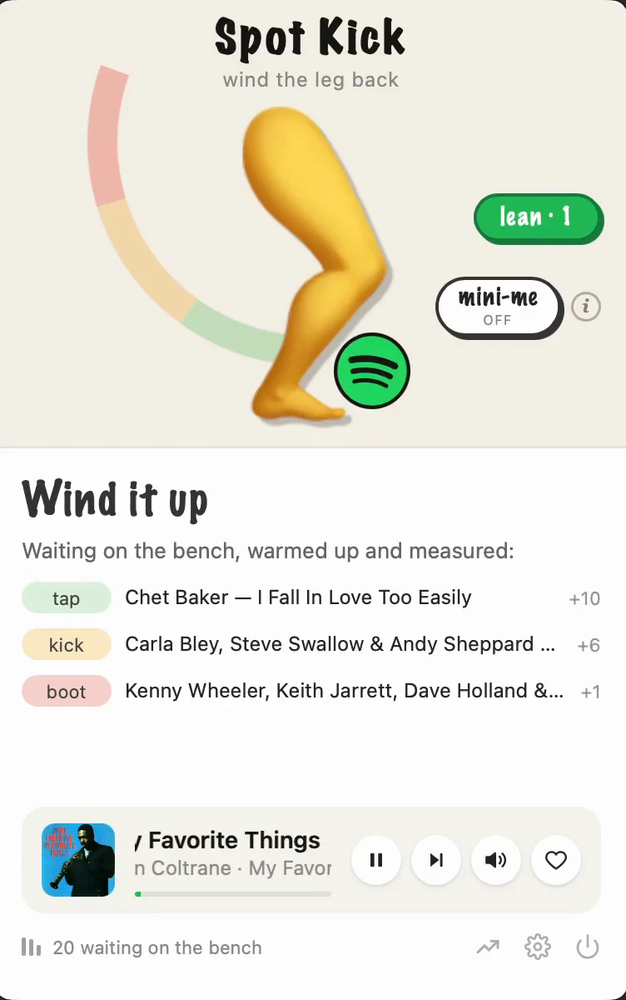
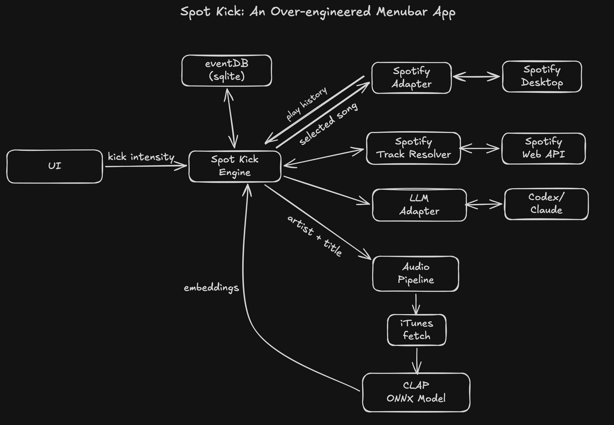

# Spot Kick 🦵

A tiny macOS experiment for nudging Spotify's recommendations.

Wind up the menubar leg and let go. Spot Kick chooses one song at roughly the distance you asked for, plays it, then gets out of the way. Spotify chooses what follows. The panel watches the next songs and reports whether Spotify returned to your old neighborhood, bent toward the kick, or followed it.

<p align="center">
  
</p>

## Getting started

Requirements:

- macOS 14 or newer, with the Spotify desktop app
- [`uv`](https://docs.astral.sh/uv/) (it fetches Python itself)
- the [Codex CLI](https://learn.chatgpt.com/docs/codex/cli) or
  [Claude Code](https://code.claude.com/docs/en/terminal-guide), installed and logged in (see "Choosing a brain")
- a Spotify developer app of your own (see "Spotify credentials")

### First-time setup

1. **Install and sign in to one brain.** You only need one of these:

   Codex:

   ```sh
   curl -fsSL https://chatgpt.com/codex/install.sh | sh
   codex                       # sign in on the first run, then exit
   ```

   Claude Code:

   ```sh
   curl -fsSL https://claude.ai/install.sh | bash
   claude                      # sign in on the first run, then exit
   ```

   Spot Kick reuses that CLI's login; it does not need an OpenAI or Anthropic API key.

2. **Create Spotify credentials.** In the [Spotify Developer Dashboard](https://developer.spotify.com/dashboard),
   create an app and select **Web API**. If the form requires a redirect URI, use
   `http://127.0.0.1:3000`; Spot Kick does not use it. Open the app's settings and copy its **Client ID** and
   **Client Secret**. These two values are what the app needs—not a single Spotify API key.

3. **Install and launch Spot Kick:**

   ```sh
   uv tool install git+https://github.com/ykumards/spot-kick
   spotkick
   ```

   The app appears in the macOS menu bar. Its first run downloads the CLAP model into `~/.spotkick/models/`.

4. **Open the gear in Spot Kick.** Choose the brain you installed, paste the Spotify Client ID and Client Secret,
   and save. The app checks the credentials before keeping them.

To update an installed copy:

```sh
uv tool upgrade spotkick
```

Nothing else is required: previews are decoded with macOS's own `afconvert`, and Spotify is driven over
AppleScript.

To work on the source instead:

```sh
git clone https://github.com/ykumards/spot-kick && cd spot-kick
uv venv .venv && uv pip install -e ".[dev]"
.venv/bin/spotkick
```

## Using Spot Kick

1. Play music in the Spotify desktop app. Spot Kick learns your recent listening and warms the tap, kick, and boot
   bench in the background.
2. Optionally set a **Lean** to constrain the candidates, or turn on **Mini-Me** to rerank nearby candidates using
   what it has learned from your listening.
3. Choose tap, kick, or boot, wind up the leg, and release. You can also open the bench and send a named song
   directly.
4. Let Spotify play the next two songs. Spot Kick measures them and settles on returned, bent, or followed.
5. If you manually change the song in Spotify, press **reset** beside **Kicked** so the unrelated song is not counted
   as Spotify following the kick.
6. Open **Stats** to inspect your ruler, bench coverage, step history, outcomes, and how each kick was selected.

### Aiming the kick

**Strength** — tap, kick, or boot — controls how far the song should land from your current listening, measured on
your own scale. A harder kick also asks the brain to search farther afield.

**Lean** narrows the search: choose up to ten genres and moods, or add words such as a language, era, or instrument.
Every candidate stays inside that Lean at every strength. Changing it clears the current bench and starts warming a
new one.

### The bench

The bench holds songs that have already been found, verified, embedded, and measured, so a kick normally plays
immediately. The main screen shows what would play for each strength and how many alternatives are waiting. Open the
bench to see every candidate on your ruler or to send a specific song directly.

Resolved candidates and their embeddings stay in the local library across restarts. Missing distance bands are
scouted again in the background, and a Lean only reuses candidates found under that same Lean.

### Mini-Me

Mini-Me learns a keep score from your local listening history: finishing a song is positive evidence, leaving very
early is negative evidence, and loving a song counts more strongly. Plays left in the middle are ignored. It needs
about twenty labelled plays, including both positive and negative examples, before it starts making choices.

Mini-Me never changes the intended distance. It only chooses which of the candidates near your target you are most
likely to keep. Until it has enough data—or while its toggle is off—the nearest candidate plays. The displayed
percentage is the model's score, not a calibrated guarantee.

Every kick records whether distance, Mini-Me, or a direct bench click made the selection. It also records the nearest
distance alternative and Mini-Me's score, so the selection can be audited later.

### Results, reset, and Stats

After a kick, the card follows Spotify's next two plays and then settles on returned, bent, or followed. If you
intervene in Spotify yourself, **reset** cancels the measurement, records that cancellation, and prevents later songs
from changing it.

Stats shows play, track, kick, and verdict counts; your current ruler and bench coverage; recent song-to-song steps;
requested and landed distances; and whether Mini-Me actually changed a selection.

## Configuration

### Spotify credentials

The brain names songs; only Spotify knows track ids. Spot Kick looks each name up with the Web API using your own
app's credentials — the Client Credentials flow, so Spot Kick itself does not open a Spotify login or OAuth browser
flow. Follow Spotify's [app setup guide](https://developer.spotify.com/documentation/web-api/concepts/apps) (any
name; select Web API), then either paste its id and secret into the panel's settings (gear icon), or from a terminal:

```sh
spotkick connect <client-id>     # prompts for the secret without echoing it
```

The credentials are checked against Spotify before anything is kept. The client id goes to
`~/.spotkick/config.toml`; the secret goes to your macOS Keychain, never to a file of ours. For terminal or CI runs
`SPOTKICK_SPOTIFY_CLIENT_SECRET` in the environment is used instead of the Keychain. Without credentials the app
still observes and logs plays, but it will not ask the brain for candidates and a kick says what is missing.

### Choosing a brain

The brain only names songs; it never sees a vector and it is never asked for a track id. It is one of two
coding-agent CLIs, run as a subprocess with whatever login it already has — no API key, no SDK. Pick it with the
radio button in the panel's settings, or in `~/.spotkick/config.toml`:

```toml
llm_backend   = "codex"             # codex · claude

llm_model     = "gpt-5.6-terra"     # Codex's model
llm_reasoning = "low"

claude_model  = "sonnet"            # Claude Code's model
```

## How it works

<p align="center">
  
</p>

The brain proposes song names and a direction while you listen. Spotify verifies each identity, iTunes supplies a
30-second preview, and CLAP embeds the audio. The brain never sees those vectors and does not decide whether a song
is near or far: Spot Kick measures and selects candidates in audio space.

Your listener state is an exponentially weighted average of recent song embeddings. The distance ruler is calibrated
against your own recent movement, so tap, kick, and boot are relative to your listening rather than universal genre
labels.

After the kicked song, Spot Kick projects the changing listener state onto the kick direction:

```text
followed = ((current − before) · (kick − before)) / |kick − before|²
```

Near zero means Spotify returned to the earlier neighborhood; near one means it continued toward the kick. The
verdict waits for two continuation songs before settling.

## Command line

Launching `spotkick` puts the app in the menu bar and returns the terminal prompt. Logs go to
`~/.spotkick/app.log`; `spotkick --foreground` keeps the process attached for debugging.

```sh
spotkick kick boot  # kick once, then watch two Spotify songs
spotkick watch      # observe plays and keep picks warm
spotkick status     # inspect the local history
spotkick prompt     # see exactly what the brain would receive
spotkick forget     # delete the local database
```

## Privacy

Tracks, embeddings, plays, skips, loves, candidates, kicks, cancellations, and selection audit fields live in
`~/.spotkick/spotkick.db`. Song names and the compact listening context are sent through the logged-in CLI (Codex
or Claude Code) when candidates are requested. Spotify receives catalog searches, and iTunes supplies candidate
audio previews; the previews are embedded locally. `spotkick forget` removes the database.

Spot Kick is not affiliated with Spotify.

## Development

```sh
.venv/bin/python -m pytest -q
RUFF_CACHE_DIR=/tmp/spotkick-ruff-cache .venv/bin/ruff check .
.venv/bin/basedpyright
```

## License

MIT.
